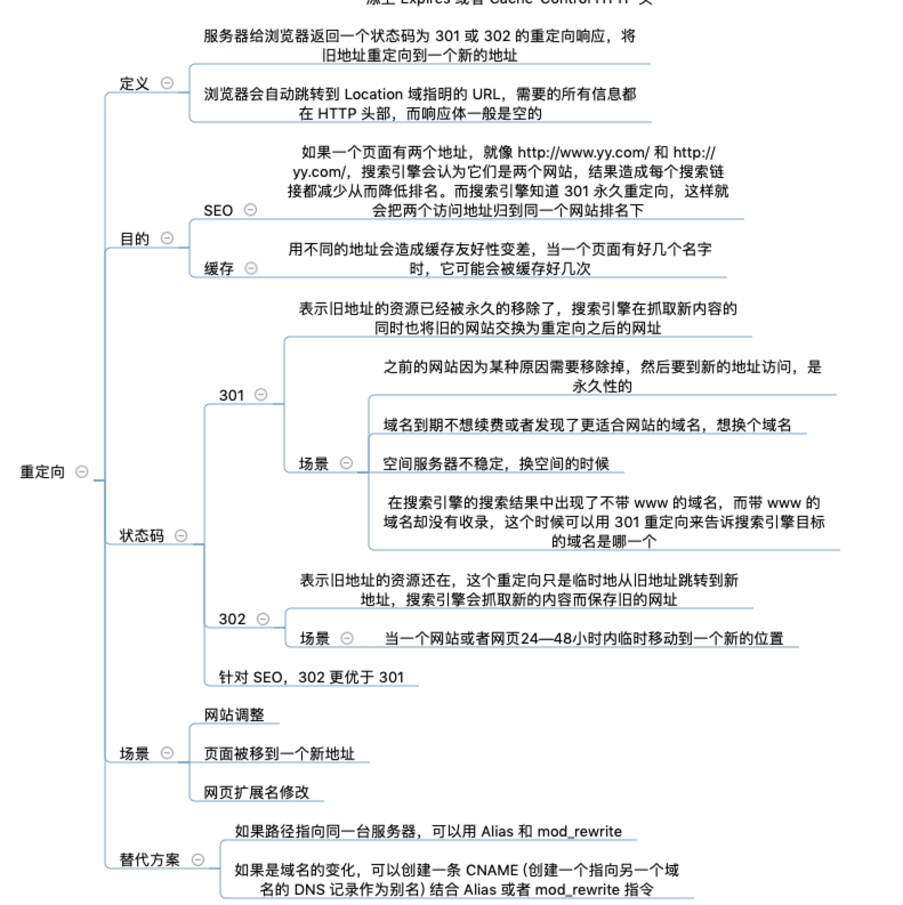

# code码

## 3xx
3xx 类状态码表示客户端请求的资源发生了变动，需要客户端用新的 URL 重新发送请求获取资源，也就是重定向。
##### 301 Moved Permanently 永久重定向
被请求的资源已永久移动到新位置，并且将来任何对此资源的引用都应该使用本响应返回的若干个 URI 之一。如果可能，拥有链接编辑功能的客户端应当自动把请求的地址修改为从服务器反馈回来的地址。除非额外指定，否则这个响应也是可缓存的。
##### 302 Found 临时重定向
请求的资源现在临时从不同的 URI 响应请求。由于这样的重定向是临时的，客户端应当继续向原有地址发送以后的请求。只有在Cache-Control或Expires中进行了指定的情况下，这个响应才是可缓存的。
###### 301 和 302 都会在响应头里使用字段 Location，指明后续要跳转的 URL，浏览器会自动重定向新的 URL。
#### 对SEO影响
- 301重定向可促进搜索引擎优化效果
从搜索引擎优化角度出发，301重定向是网址重定向最为可行的一种办法。当网站的域名发生变更后，搜索引擎只对新网址进行索引，同时又会把旧地址下原有的外部链接如数转移到新地址下，从而不会让网站的排名因为网址变更而收到丝毫影响。同样，在使用301永久性重定向命令让多个域名指向网站主域时，亦不会对网站的排名产生任何负面影响。
- 302重定向可影响搜索引擎优化效果
迄今为止，能够对302重定向具备优异处理能力的只有Google。也就是说，在网站使用302重定向命令将其它域名指向主域时，只有Google会把其它域名的链接成绩计入主域，而其它搜索引擎只会把链接成绩向多个域名分摊，从而削弱主站的链接总量。既然作为网站排名关键因素之一的外链数量受到了影响，网站排名降低也是很自然的事情了。

##### 303 See Other
对应当前请求的响应可以在另一个 URI 上被找到，而且客户端应当采用 GET 的方式访问那个资源。这个方法的存在主要是为了允许由脚本激活的POST请求输出重定向到一个新的资源。
##### 304 Not Modified 缓存重定向
如果客户端发送了一个带条件的 GET 请求且该请求已被允许，而文档的内容（自上次访问以来或者根据请求的条件）并没有改变，则服务器应当返回这个状态码。304 响应禁止包含消息体，因此始终以消息头后的第一个空行结尾。
不具有跳转的含义，表示资源未修改，重定向已存在的缓冲文件，也称缓存重定向，也就是告诉客户端可以继续使用缓存资源，用于缓存控制。
