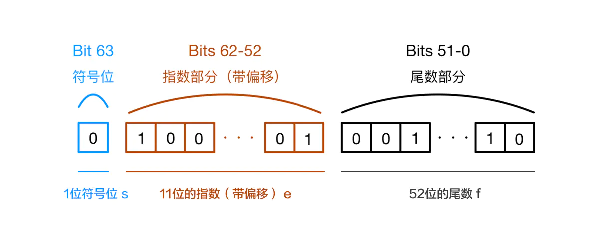

# JS 数据类型
js的数据类型主要分为两大类：

*   原始数据类型
*   引用数据类型

## 原始数据类型
JS 中分为七种内置类型，七种内置类型又分为两大类型：原始数据类型和引用数据类型。

原始数据类型有七种：
+ boolean
+ null
+ undefined
+ number
+ string
+ symbol
+ bigint

其中 JS 的数字类型是浮点类型的，没有整型。并且浮点类型基于 IEEE 754标准实现，在使用中会遇到某些 Bug。NaN 也属于 number 类型，并且 NaN 不等于自身。
对于基本类型来说，如果使用字面量的方式，那么这个变量只是个字面量，只有在必要的时候才会转换为对应的类型

```js 
let mu = 666  // 这只是字面量，不是 number 类型
mu.toString() // 使用时候才会转换为对象类型
```
### null和undefined
null与undefined都可以表示“没有”，含义非常相似。将一个变量赋值为undefined或null，老实说，语法效果几乎没区别。
```js
var a = undefined;
// or
var a = null;
```
上面代码中，变量a分别被赋值为undefined和null，这两种写法的效果几乎等价。
在if语句中，它们都会被自动转为false，相等运算符（==）甚至直接报告两者相等。

1995年 JavaScript 诞生时，最初像 Java 一样，只设置了null表示"无"。根据 C 语言的传统，null可以自动转为0。
```js
Number(null)  // 0
5 + null      // 5
```

#### 区别
两者区别是这样的：null是一个表示“空”的对象，转为数值时为0；undefined是一个表示"此处无定义"的原始值，转为数值时为NaN。
```js
Number(undefined) // NaN
5 + undefined // NaN
```

#### 用法和含义
null表示空值，即该处的值现在为空。调用函数时，某个参数未设置任何值，这时就可以传入null，表示该参数为空。比如，某个函数接受引擎抛出的错误作为参数，如果运行过程中未出错，那么这个参数就会传入null，表示未发生错误。

undefined表示“未定义”，下面是返回undefined的典型场景。
``` js
// 变量声明了，但没有赋值
var i;
i // undefined

// 调用函数时，应该提供的参数没有提供，该参数等于 undefined
function f(x) {
  return x;
}
f() // undefined

// 对象没有赋值的属性
var  o = new Object();
o.p // undefined

// 函数没有返回值时，默认返回 undefined
function f() {}
f() // undefined
```

### 布尔值
布尔值代表“真”和“假”两个状态。“真”用关键字true表示，“假”用关键字false表示。布尔值只有这两个值。

下列运算符会返回布尔值：
> - 前置逻辑运算符： ! (Not)
> - 相等运算符：\=\=\=，\!=\=，==，\!=
> - 比较运算符：>，>=，<，<=

如果 JavaScript 预期某个位置应该是布尔值，会将该位置上现有的值自动转为布尔值。转换规则是除了下面六个值被转为false，其他值都视为true。
> - undefined
> - null
> - false
> - 0
> - NaN
> - ""或''（空字符串）

>
> 注意，空数组（[]）和空对象（{}）对应的布尔值，都是true。
>


### number数值

#### 整数和浮点数
JavaScript 内部，所有数字都是以64位浮点数形式储存，即使整数也是如此。所以，1与1.0是相同的，是同一个数。
> 1 === 1.0 // true

这就是说，JavaScript 语言的底层根本没有整数，所有数字都是小数（64位浮点数）。容易造成混淆的是，某些运算只有整数才能完成，此时 JavaScript 会自动把64位浮点数，转成32位整数，然后再进行运算，参见《运算符》一章的“位运算”部分。

由于浮点数不是精确的值，所以涉及小数的比较和运算要特别小心。
``` js
0.1 + 0.2 === 0.3
// false

0.3 / 0.1
// 2.9999999999999996

(0.3 - 0.2) === (0.2 - 0.1)
// false
```
0.1和0.2在转换成二进制后会无限循环，由于标准位数的限制后面多余的位数会被截掉，此时就已经出现了精度的损失，相加后因浮点数小数位的限制而截断的二进制数字在转换为十进制就会变成0.30000000000000004。
运算时发生了什么
1.进制转换
0.1和0.2转换成二进制后会无限循环
> 0.1 -> 0.0001100110011001...(无限循环)
> 0.2 -> 0.0011001100110011...(无限循环)
但是由于IEEE 754尾数位数限制，需要将后面多余的位截掉
这样在进制之间的转换中精度已经损失

标准中规定尾数f的固定长度是52位，再加上省略的一位，这53位是JS精度范围。它最大可以表示2^53(9007199254740992), 长度是 16，所以可以使用 toPrecision(16) 来做精度运算，超过的精度会自动做凑整处理

2.对阶运算
由于指数位数不相同，运算时需要对阶运算 这部分也可能产生精度损失

按照上面两步运算（包括两步的精度损失），最后的结果是
> 0.0100110011001100110011001100110011001100110011001100 

结果转换成十进制之后就是0.30000000000000004，这样就有了前面的“秀”操作：0.1 + 0.2 != 0.3

***精度损失可能出现在进制转化和对阶运算过程中***

只要在这两步中产生了精度损失，计算结果就会出现偏差


### 数值精度
根据国际标准 IEEE 754，JavaScript 浮点数的64个二进制位，从最左边开始，是这样组成的。



- 第1位：符号位，0表示正数，1表示负数 s
- 第2位到第12位（共11位）：指数部分 e
- 第13位到第64位（共52位）：小数部分（即有效数字）f

符号位决定了一个数的正负，指数部分决定了数值的大小，小数部分决定了数值的精度。

指数部分一共有11个二进制位，因此大小范围就是0到2047。IEEE 754 规定，如果指数部分的值在0到2047之间（不含两个端点），那么有效数字的第一位默认总是1，不保存在64位浮点数之中。也就是说，有效数字这时总是1.xx...xx的形式，其中xx..xx的部分保存在64位浮点数之中，最长可能为52位。因此，JavaScript 提供的有效数字最长为53个二进制位
> (-1)^符号位 * 1.xx...xx * 2^指数部分
上面公式是正常情况下（指数部分在0到2047之间），一个数在 JavaScript 内部实际的表示形式。

精度最多只能到53个二进制位，这意味着，绝对值小于2的53次方的整数，即-253到253，都可以精确表示。
```js
Math.pow(2, 53)
// 9007199254740992

Math.pow(2, 53) + 1
// 9007199254740992

Math.pow(2, 53) + 2
// 9007199254740994

Math.pow(2, 53) + 3
// 9007199254740996

Math.pow(2, 53) + 4
// 9007199254740996
```
上面代码中，大于2的53次方以后，整数运算的结果开始出现错误。所以，大于2的53次方的数值，都无法保持精度。由于2的53次方是一个16位的十进制数值，所以简单的法则就是，JavaScript 对15位的十进制数都可以精确处理。
```js
Math.pow(2, 53)
// 9007199254740992

// 多出的三个有效数字，将无法保存
9007199254740992111
// 9007199254740992000

Number.MAX_SAFE_INTEGER === Math.pow(2,53) - 1
// 9007199254740991
// Number.MAX_SAFE_INTEGER 常量表示在 JavaScript 中最大的安全整数（maxinum safe integer)（2^53 - 1)
// 这是因为二进制表示有效数字总是1.xx…xx的形式，尾数部分f在规约形式下第一位默认为1（省略不写，xx..xx为尾数部分f，最长52位）。因此，JavaScript提供的有效数字最长为53个二进制位（64位浮点的后52位+被省略的1位）

Number.MIN_SAFE_INTEGER
// -9007199254740991
// Number.MIN_SAFE_INTEGER 代表在 JavaScript中最小的安全的integer型数字 (-(253 - 1)).

```
上面示例表明，大于2的53次方以后，多出来的有效数字（最后三位的111）都会无法保存，变成0。

解决精度问题
1.将数字转成整数
```js

function add(num1, num2) {
 const num1Digits = (num1.toString().split('.')[1] || '').length;
 const num2Digits = (num2.toString().split('.')[1] || '').length;
 const baseNum = Math.pow(10, Math.max(num1Digits, num2Digits));
 return (num1 * baseNum + num2 * baseNum) / baseNum;
}

```

2.三方库
1).Math.js
2).big.js

### 数值范围
根据标准，64位浮点数的指数部分的长度是11个二进制位，意味着指数部分的最大值是2047（2的11次方减1）。也就是说，64位浮点数的指数部分的值最大为2047，分出一半表示负数，则 JavaScript 能够表示的数值范围为2^1024到 2^-1023（开区间），超出这个范围的数无法表示。

如果一个数大于等于2的1024次方，那么就会发生“正向溢出”，即 JavaScript 无法表示这么大的数，这时就会返回Infinity。

```js
Math.pow(2, 1024) // Infinity
```
如果一个数小于等于2的-1075次方（指数部分最小值-1023，再加上小数部分的52位），那么就会发生为“负向溢出”，即 JavaScript 无法表示这么小的数，这时会直接返回0。
```js
Math.pow(2, -1075) // 0
```
下面是一个实际的例子。
```js
var x = 0.5;

for(var i = 0; i < 25; i++) {
  x = x * x;
}

x // 0
```
上面代码中，对0.5连续做25次平方，由于最后结果太接近0，超出了可表示的范围，JavaScript 就直接将其转为0。

JavaScript 提供Number对象的MAX_VALUE和MIN_VALUE属性，返回可以表示的具体的最大值和最小值。

### 数值的表示法
JavaScript 的数值有多种表示方法，可以用字面形式直接表示，比如35（十进制）和0xFF（十六进制）。

数值也可以采用科学计数法表示，下面是几个科学计数法的例子。
```js
123e3 // 123000
123e-3 // 0.123
-3.1E+12
.1e-23
```
科学计数法允许字母e或E的后面，跟着一个整数，表示这个数值的指数部分。

以下两种情况，JavaScript 会自动将数值转为科学计数法表示，其他情况都采用字面形式直接表示。
（1）小数点前的数字多于21位。
```js
1234567890123456789012
// 1.2345678901234568e+21

123456789012345678901
// 123456789012345680000
```
（2）小数点后的零多于5个。
```js
// 小数点后紧跟5个以上的零，
// 就自动转为科学计数法
0.0000003 // 3e-7

// 否则，就保持原来的字面形式
0.000003 // 0.000003
```
### 数值的进制
使用字面量（literal）直接表示一个数值时，JavaScript 对整数提供四种进制的表示方法：十进制、十六进制、八进制、二进制。

- 十进制：没有前导0的数值。
- 八进制：有前缀0o或0O的数值，或者有前导0、且只用到0-7的八个阿拉伯数字的数值。
- 十六进制：有前缀0x或0X的数值。
- 二进制：有前缀0b或0B的数值。

默认情况下，JavaScript 内部会自动将八进制、十六进制、二进制转为十进制。下面是一些例子。
```js
0xff // 255
0o377 // 255
0b11 // 3

// 如果八进制、十六进制、二进制的数值里面，出现不属于该进制的数字，就会报错。
0xzz // 报错
0o88 // 报错
0b22 // 报错
// 上面代码中，十六进制出现了字母z、八进制出现数字8、二进制出现数字2，因此报错。
```
通常来说，有前导0的数值会被视为八进制，但是如果前导0后面有数字8和9，则该数值被视为十进制
```js
0888 // 888
0777 // 511
```
前导0表示八进制，处理时很容易造成混乱。ES5 的严格模式和 ES6，已经废除了这种表示法，但是浏览器为了兼容以前的代码，目前还继续支持这种表示法。

### NaN
NaN是 JavaScript 的特殊值，表示“非数字”（Not a Number），主要出现在将字符串解析成数字出错的场合。
需要注意的是，NaN不是独立的数据类型，而是一个特殊数值，它的数据类型依然属于Number，使用typeof运算符可以看得很清楚。
``` js
typeof NaN // 'number'
```
NaN不等于任何值，包括它本身。
``` js
NaN === NaN // false
[NaN].indexOf(NaN) // -1
Boolean(NaN) // false

NaN + 32 // NaN
NaN - 32 // NaN
NaN * 32 // NaN
NaN / 32 // NaN
```

isNaN方法可以用来判断一个值是否为NaN。
isNaN只对数值有效，如果传入其他值，会被先转成数值。比如，传入字符串的时候，字符串会被先转成NaN，所以最后返回true，这一点要特别引起注意。也就是说，isNaN为true的值，有可能不是NaN，而是一个字符串。
``` js
isNaN('Hello') // true
// 相当于
isNaN(Number('Hello')) // true


isNaN({}) // true
// 等同于
isNaN(Number({})) // true

isNaN(['xzy']) // true
// 等同于
isNaN(Number(['xzy'])) // true
```

对于空数组和只有一个数值成员的数组，isNaN返回false。
``` js
isNaN([]) // false
isNaN([123]) // false
isNaN(['123']) // false
```

使用isNaN之前，最好判断一下数据类型。
``` js
function myIsNaN(value){
  return typeof value === 'number' && isNaN(value)
}
```
判断NaN更可靠的方法是，利用NaN为唯一不等于自身的值的这个特点，进行判断。
```js
function myIsNaN(value) {
  return value !== value;
}
```
#### isFinite()
isFinite方法返回一个布尔值，表示某个值是否为正常的数值。
``` js
isFinite(Infinity) // false
isFinite(-Infinity) // false
isFinite(NaN) // false
isFinite(undefined) // false
isFinite(null) // true
isFinite(-1) // true
```
除了Infinity、-Infinity、NaN和undefined这几个值会返回false，isFinite对于其他的数值都会返回true。
### BigInt
BigInt是一种新的数据类型，用于当整数值大于Number数据类型支持的范围时。这种数据类型允许我们安全地对大整数执行算术操作，表示高分辨率的时间戳，使用大整数id，等等，而不需要使用库。

JS中的Number无法精确表示非常大的整数，它会将非常大的整数四舍五入，确切地说，JS中的Number类型只能安全地表示-9007199254740991(-(2^53-1))和9007199254740991（(2^53-1)）详细看上文，任何超出此范围的整数值都可能失去精度。

#### 创建使用BigInt
要创建BigInt，只需要在数字末尾追加n即可。
```js
const Big = 9007199254740995n  // → 9007199254740995n	
```
另一种创建BigInt的方法是用BigInt()构造函数、
``` js
BigInt("9007199254740995");    // → 9007199254740995n
```
#### 值得警惕的点
1.BigInt不支持一元加号运算符, 这可能是某些程序可能依赖于 + 始终生成 Number 的不变量，或者抛出异常。另外，更改 + 的行为也会破坏 asm.js代码。
2.因为隐式类型转换可能丢失信息，所以不允许在bigint和 Number 之间进行混合操作。当混合使用大整数和浮点数时，结果值可能无法由BigInt或Number精确表示。
3.不能将BigInt传递给Web api和内置的 JS 函数，这些函数需要一个 Number 类型的数字。尝试这样做会报TypeError错误。
4.当 Boolean 类型与 BigInt 类型相遇时，BigInt的处理方式与Number类似，换句话说，只要不是0n，BigInt就被视为truthy的值。
5.元素都为BigInt的数组可以进行sort。
6.BigInt可以正常地进行位运算，如|、&、<<、>>和^
其实现在的兼容性并不怎么好，只有chrome67、firefox、Opera这些主流实现，要正式成为规范，其实还有很长的路要走。
## 引用数据类型
对象Object（包含普通对象-Object，数组对象-Array，正则对象-RegExp，日期对象-Date，数学函数-Math，函数对象-Function）
对象是最复杂的数据类型，又可以分成三个子类型。
- 狭义的对象（object）
- 数组（array）
- 函数（function）

引用类型Object： Array ， Function ， Date ， RegExp 等
狭义的对象和数组是两种不同的数据组合方式，除非特别声明，本教程的“对象”都特指狭义的对象。
函数其实是处理数据的方法，JavaScript 把它当成一种数据类型，可以赋值给变量，这为编程带来了很大的灵活性，也为 JavaScript 的“函数式编程”奠定了基础。

对象（Object）是引用类型，在使用过程中会遇到浅拷贝和深拷贝的问题。
```js 
let a = { name: 'FE' }
let b = a
b.name = 'EF'
console.log(a.name) // EF
```
